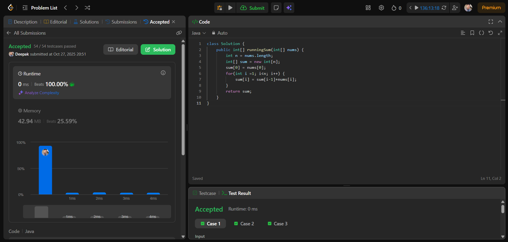

# 🧠 Day 1 – Arrays (Easy)

**📅 Date:** October 28, 2025  
**💻 Language:** Java  
**📚 Topic:** Arrays – Basics

---

## ✅ Problems Solved
| Problem | LeetCode # | Description |
|:--|:--:|:--|
| [Reverse String](https://leetcode.com/problems/reverse-string/) | #344 | Reverse the characters of a char array in-place. |
| [Running Sum of 1D Array](https://leetcode.com/problems/running-sum-of-1d-array/) | #1480 | Compute prefix running sum for each index in the array. |

---

## 💡 Concepts Practiced
- Array traversal and indexing  
- In-place modification of array elements  
- Two-pointer technique for efficient swapping  
- Prefix sum logic for cumulative results  
- Strengthening core Java coding skills  

---

## 🧩 Output Screenshots
| Problem | Result |
|:--|:--|
| Reverse String |  |
| Running Sum of 1D Array |  |

---

## 🏁 Summary
Day 1 of **100 Days of DSA** ✅  
Practiced important array operations with both in-place reversal and prefix-sum logic.  
A confident beginning toward strong problem-solving and consistency 🚀💪
