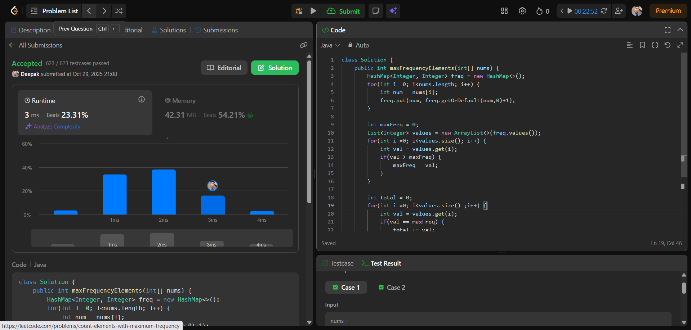

# 🧠 Day 3 – Arrays (Easy)

**📅 Date:** October 29, 2025  
**💻 Language:** Java  
**📚 Topic:** Frequency & Duplicate Detection in Arrays  

---

## ✅ Problems Solved
| Problem | LeetCode # | Description |
|:--|:--:|:--|
| [Find the Duplicate Number](https://leetcode.com/problems/find-the-duplicate-number/) | #287 | Identify the duplicate element in an array of `n+1` integers. |
| [Count Elements With Maximum Frequency](https://leetcode.com/problems/count-elements-with-maximum-frequency/) | #3005 | Count all elements that appear with the highest frequency in the array. |

---

## 💡 Concepts Practiced
- Hashing technique using frequency arrays/maps  
- Detecting duplicates efficiently  
- Iterating and comparing frequency counts  
- Understanding time and space complexity  
- Strengthening core DSA array fundamentals  

---

## 🧩 Output Screenshots
| Problem | Result |
|:--|:--|
| Find the Duplicate Number |  |
| Count Max Frequency |  |

---

## 🏁 Summary
Day 3 of **100 Days of DSA** ✅  
Solved two key array problems on frequency & duplicates.  
Boosted confidence and accuracy in array-based logical reasoning 🚀🔥
