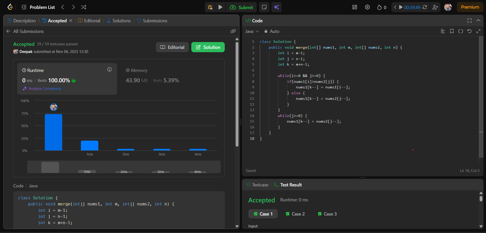

# 🧠 Day 10 – Arrays (Easy)

**📅 Date:** November 6, 2025  
**💻 Language:** Java  
**📚 Topic:** Merge Sorted Array  

---

## ✅ Problem Solved
| Problem | LeetCode # | Description |
|:--|:--:|:--|
| [Merge Sorted Array](https://leetcode.com/problems/merge-sorted-array/) | #88 | Merge two sorted arrays `nums1` and `nums2` into one sorted array in-place, starting from the end of `nums1`. |

---

## 💡 Concepts Practiced
- **Two-pointer technique** (starting from the end)  
- Performing **in-place merging** efficiently without extra space  
- Managing **array indices** using backward traversal  
- Handling **edge cases** where one array is empty  
- Achieved optimal **O(m + n)** time and **O(1)** space complexity  
- Strengthened understanding of **reverse traversal merging**

---

## 🧩 Output Screenshot
| Problem | Result |
|:--|:--|
| Merge Sorted Array |  |

---

## 🏁 Summary
Day 10 of **100 Days of DSA** ✅  
Practiced the classic **array merging** problem using the **two-pointer approach** in reverse.  
Learned how to merge two sorted arrays **in-place** without using extra space — a key concept for mastering **array manipulation and efficiency** ⚡🚀  
