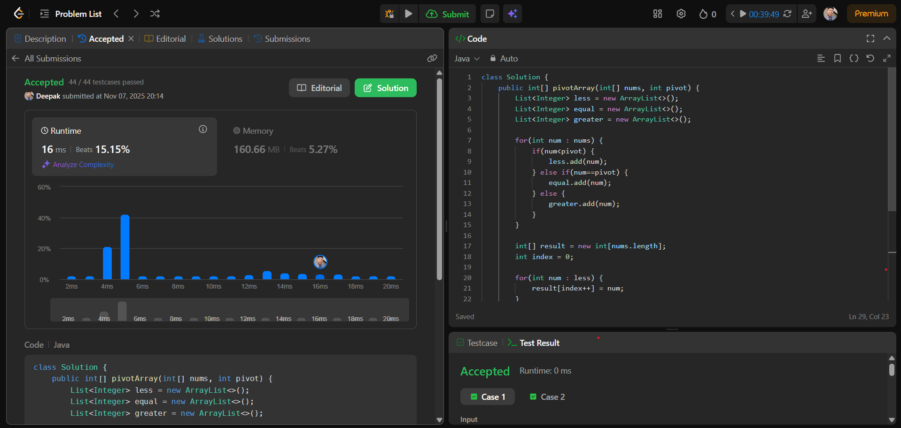

# 🧠 Day 11 – Arrays (Easy)

**📅 Date:** November 6, 2025  
**💻 Language:** Java  
**📚 Topic:** Partition Array According to Given Pivot  

---

## ✅ Problem Solved
| Problem | LeetCode # | Description |
|:--|:--:|:--|
| [Partition Array According to Given Pivot](https://leetcode.com/problems/partition-array-according-to-given-pivot/) | #2161 | Rearrange the array so that all elements less than the pivot come first, followed by equal elements, and then greater elements — while maintaining their original order. |

---

## 💡 Concepts Practiced
- **Stable partitioning** (preserving relative order)  
- Dividing elements into **three logical groups** — less than, equal to, and greater than pivot  
- Combining the groups back into a **single result array**  
- Strengthened logic building for **pivot-based array problems**  
- Achieved clean and simple **O(n)** time complexity  
- Used **ArrayList** for flexible element handling before merging  

---

## 🧩 Output Screenshot
| Problem | Result |
|:--|:--|
| Partition Array According to Given Pivot |  |

---

## 🏁 Summary
Day 11 of **100 Days of DSA** ✅  
Practiced an elegant approach to **partition an array** while maintaining element order.  
Learned how to categorize and merge elements around a pivot — a foundation concept for **quicksort** and **stable rearrangements** ⚡🚀  
Enhanced understanding of **array traversal, conditional grouping, and merging techniques.**  
