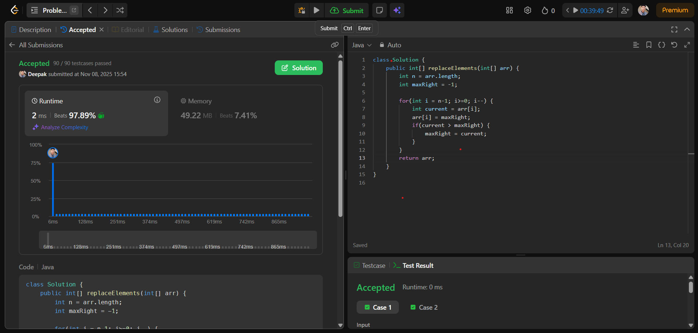

# 🧠 Day 12 – Arrays (Easy)

**📅 Date:** November 8, 2025  
**💻 Language:** Java  
**📚 Topic:** Replace Elements with Greatest Element on Right Side  

---

## ✅ Problem Solved
| Problem | LeetCode # | Description |
|:--|:--:|:--|
| [Replace Elements with Greatest Element on Right Side](https://leetcode.com/problems/replace-elements-with-greatest-element-on-right-side/) | #1299 | Replace every element with the greatest element among those to its right, and set the last element to -1. |

---

## 💡 Concepts Practiced
- Understanding **right-side maximum updates** in arrays  
- Practiced **reverse traversal** (iterating from right to left)  
- Mastered in-place array manipulation with **O(1) space**  
- Strengthened logical thinking for **array scanning problems**  
- Achieved efficient **O(n)** time complexity solution  
- Gained better understanding of **suffix-based updates**

---

## 🧩 Output Screenshot
| Problem | Result |
|:--|:--|
| Replace Elements with Greatest Element on Right Side |  |

---

## 🏁 Summary
Day 12 of **100 Days of DSA** ✅  
Practiced an elegant reverse traversal technique to update array elements based on their right-side values.  
This problem strengthened my confidence in **suffix computation** and **in-place transformations**, paving the way for solving more advanced **array modification** problems efficiently 🚀🔥  
