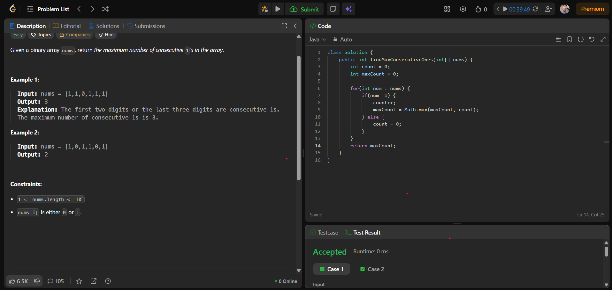

# 🧠 Day 13 – Arrays (Easy)

**📅 Date:** November 9, 2025  
**💻 Language:** Java  
**📚 Topic:** Max Consecutive Ones  

---

## ✅ Problem Solved
| Problem | LeetCode # | Description |
|:--|:--:|:--|
| [Max Consecutive Ones](https://leetcode.com/problems/max-consecutive-ones/) | #485 | Find the maximum number of consecutive 1's in a binary array. |

---

## 💡 Concepts Practiced
- Strengthened understanding of **array traversal and counting logic**  
- Learned how to **track continuous sequences** using a counter variable  
- Applied **conditional logic (if–else)** to detect streak breaks  
- Practiced using **`Math.max()`** for real-time maximum updates  
- Achieved **O(n)** time complexity and **O(1)** space efficiency  
- Enhanced logical thinking for **streak-based problems**  

---

## 🧩 Output Screenshot
| Problem | Result |
|:--|:--|
| Max Consecutive Ones |  |

---

## 🏁 Summary
Day 13 of **100 Days of DSA** ✅  
Practiced a simple yet powerful concept of identifying **continuous sequences** within arrays.  
This problem helped me build a strong foundation in **loop control**, **state tracking**, and **conditional logic**, preparing me for more complex pattern-based array problems ahead 🚀🔥  
