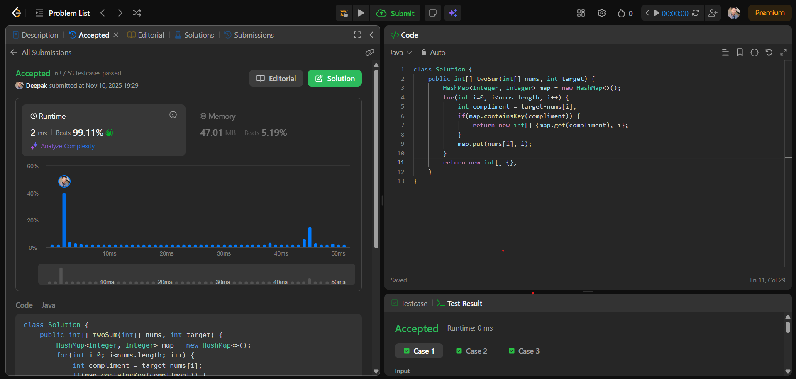

# 🧠 Day 14 – Arrays (Easy)

**📅 Date:** November 10, 2025  
**💻 Language:** Java  
**📚 Topic:** Two Sum  

---

## ✅ Problem Solved
| Problem | LeetCode # | Description |
|:--|:--:|:--|
| [Two Sum](https://leetcode.com/problems/two-sum/) | #1 | Find two distinct indices in an array whose elements add up to a given target. |

---

## 💡 Concepts Practiced
- Strengthened understanding of **hashmaps** for fast value lookups  
- Learned to compute and check **complement pairs** dynamically (`target - nums[i]`)  
- Practiced **single-pass traversal** with simultaneous searching and storing  
- Applied **conditional checks** to detect valid pairs instantly  
- Achieved **O(n)** time complexity and **O(n)** space efficiency  
- Improved problem-solving approach for **mapping and searching problems**  

---

## 🧩 Output Screenshot
| Problem | Result |
|:--|:--|
| Two Sum |  |

---

## 🏁 Summary
Day 14 of **100 Days of DSA** ✅  
Solved a classic problem that built a solid understanding of **hash-based searching** and **pair identification** in arrays.  
This challenge strengthened my logical reasoning and taught me how to use **HashMap** effectively for **optimized lookups** — an essential concept for upcoming **array and hashing problems** 🚀🔥
