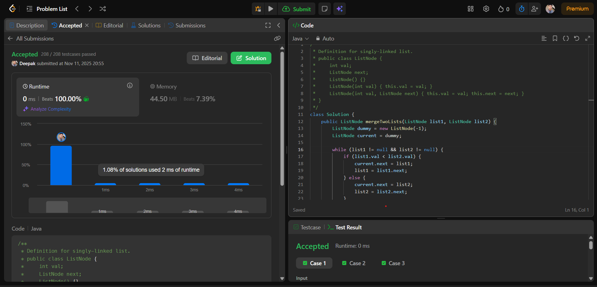

# 🧠 Day 15 – Linked List (Easy)

**📅 Date:** November 11, 2025  
**💻 Language:** Java  
**📚 Topic:** Merge Two Sorted Lists  

---

## ✅ Problem Solved
| Problem | LeetCode # | Description |
|:--|:--:|:--|
| [Merge Two Sorted Lists](https://leetcode.com/problems/merge-two-sorted-lists/) | #21 | Merge two sorted linked lists into one sorted list and return the merged head node. |

---

## 💡 Concepts Practiced
- Strengthened understanding of **linked list traversal** and **pointer manipulation**  
- Implemented **dummy node technique** for simplified list merging  
- Practiced handling **edge cases** where one list may be empty  
- Explored both **iterative** and **recursive** merging approaches  
- Achieved **O(n + m)** time complexity and **O(1)** extra space  
- Enhanced confidence in working with **ListNode structures** and **data linking**  

---

## 🧩 Output Screenshot
| Problem | Result |
|:--|:--|
| Merge Two Sorted Lists |  |

---

## 🏁 Summary
Day 15 of **100 Days of DSA** ✅  
Solved an essential **Linked List** problem that deepened my understanding of **node operations, traversal logic, and merging techniques**.  
This challenge improved my ability to write **clean and efficient pointer-based code**, laying a strong foundation for tackling more advanced **Linked List and recursion problems** in upcoming challenges 🚀🔥
