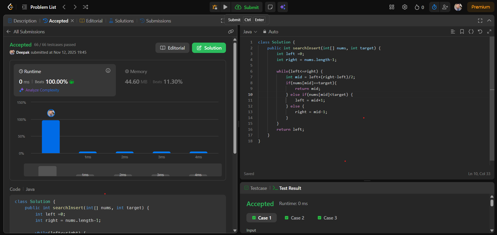

# 🧠 Day 16 – Arrays (Easy)

**📅 Date:** November 12, 2025  
**💻 Language:** Java  
**📚 Topic:** Search Insert Position  

---

## ✅ Problem Solved
| Problem | LeetCode # | Description |
|:--|:--:|:--|
| [Search Insert Position](https://leetcode.com/problems/search-insert-position/) | #35 | Given a sorted array of distinct integers and a target value, return the index if found, or the index where it should be inserted in order. |

---

## 💡 Concepts Practiced
- Strengthened understanding of **binary search** and **mid-point logic**  
- Learned to efficiently **find the correct index** or insertion point  
- Practiced adjusting **search range** using `left`, `right`, and `mid` pointers  
- Achieved **O(log n)** time complexity and **O(1)** space efficiency  
- Improved ability to handle **edge cases** in sorted arrays  
- Enhanced confidence in solving **search-based array problems**

---

## 🧩 Output Screenshot
| Problem | Result |
|:--|:--|
| Search Insert Position |  |

---

## 🏁 Summary
Day 16 of **100 Days of DSA** ✅  
Solved an important **binary search** problem that strengthened my grasp of **search logic** and **index handling** in sorted arrays.  
This challenge improved my ability to think **logically and efficiently**, laying a strong base for more advanced **searching and sorting algorithms** in the upcoming days 🚀🔥
