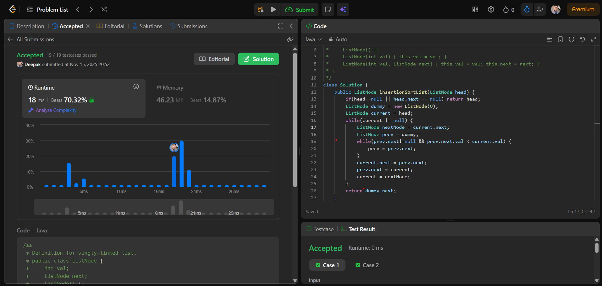

# 🧠 Day 19 – Linked List (Medium)

**📅 Date:** November 15, 2025  
**💻 Language:** Java  
**📚 Topic:** Insertion Sort on Linked List  

---

## ✅ Problem Solved
| Problem | LeetCode # | Description |
|:--|:--:|:--|
| [Insertion Sort List](https://leetcode.com/problems/insertion-sort-list/) | #147 | Sort a singly linked list using the **insertion sort** algorithm by placing each node into its correct sorted position. |

---

## 💡 Concepts Practiced
- Understood how **insertion sort** works on a linked list  
- Learned to use a **dummy node** to simplify insert operations  
- Practiced finding the **correct insertion point** for each node  
- Improved handling of **pointer manipulation** in linked lists  
- Strengthened logic building and step-by-step **node insertion**  
- Achieved a clean, readable solution with **O(n²)** time complexity  

---

## 🧩 Output Screenshot
| Problem | Result |
|:--|:--|
| Insertion Sort List |  |

---

## 🏁 Summary
Day 19 of **100 Days of DSA** ✅  
Successfully solved a fundamental **linked list sorting** problem using the insertion sort technique.  
This problem helped me improve my understanding of **node manipulation**, insertion logic, and how classic sorting algorithms work differently on linked lists.  
A great practice for strengthening linked list concepts and mastering structured algorithmic thinking 🚀🔥
