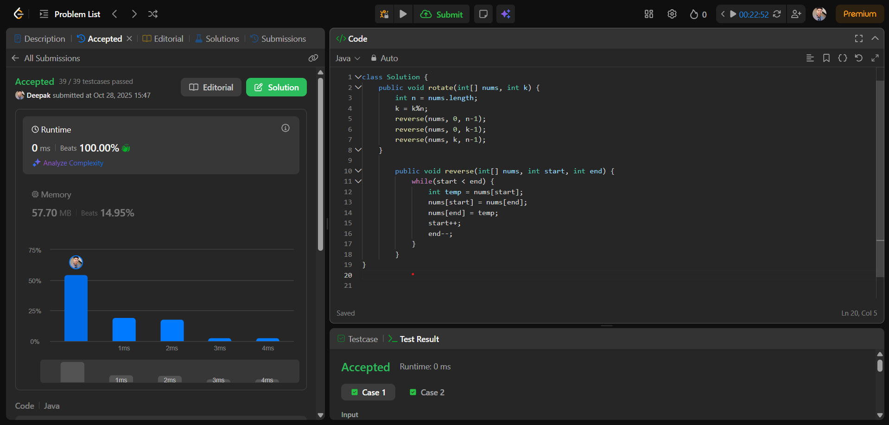

# 🧠 Day 2 – Arrays (Easy)

**📅 Date:** October 28, 2025  
**💻 Language:** Java  
**📚 Topic:** Array Rotation & 2D Array Summation  

---

## ✅ Problems Solved
| Problem | LeetCode # | Description |
|:--|:--:|:--|
| [Rotate Array](https://leetcode.com/problems/rotate-array/) | #189 | Rotate an array to the right by *k* steps using the reverse technique. |
| [Richest Customer Wealth](https://leetcode.com/problems/richest-customer-wealth/) | #1672 | Find the customer with the highest total wealth from a 2D array. |

---

## 💡 Concepts Practiced
- Array reverse technique for rotation  
- Modulo operation for optimized rotations  
- 2D array traversal and summation  
- Time and space complexity analysis  
- Strengthening core Java skills in array manipulation  

---

## 🧩 Output Screenshots
| Problem | Result |
|:--|:--|
| Rotate Array |  |
| Richest Customer Wealth |  |

---

## 🏁 Summary
Day 2 of **100 Days of DSA** ✅  
Solved two important array problems involving rotation and customer wealth calculation.  
Improved confidence in handling array logic and built consistency in daily DSA practice 🚀🔥
