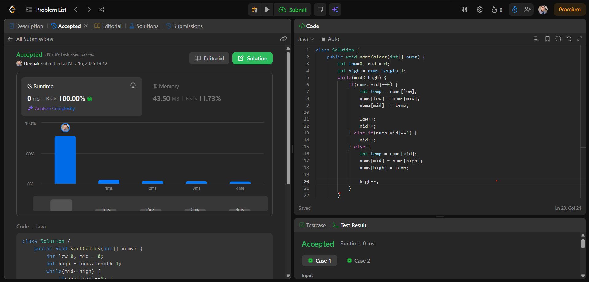

# 🧠 Day 20 – Arrays (Medium)

**📅 Date:** November 16, 2025  
**💻 Language:** Java  
**📚 Topic:** Sort Colors (3-Way Partitioning)

---

## ✅ Problem Solved
| Problem | LeetCode # | Description |
|:--|:--:|:--|
| [Sort Colors](https://leetcode.com/problems/sort-colors/) | #75 | Sort an array of **0s, 1s, and 2s** using the Dutch National Flag Algorithm with a **single-pass 3-way partition**. |

---

## 💡 Concepts Practiced
- Learned the **Dutch National Flag Algorithm**  
- Understood how **3-way partitioning** works  
- Used three pointers → **low, mid, high**  
- Practiced efficient **in-place swapping**  
- Improved logic building for **single-pass O(n)** algorithms  
- Strengthened understanding of **constant space sorting** problems  

---

## 🧩 Output Screenshot
| Problem | Result |
|:--|:--|
| Sort Colors |  |

---

## 🏁 Summary
Day 20 of **100 Days of DSA** ✅  
Solved an important array problem using the **Dutch National Flag approach**, which is widely asked in interviews.  
This problem improved my understanding of **pointer movement**, **element partitioning**, and writing clean, optimal solutions.  
A great practice for mastering efficient array manipulation and real-world sorting logic 🚀🔥
