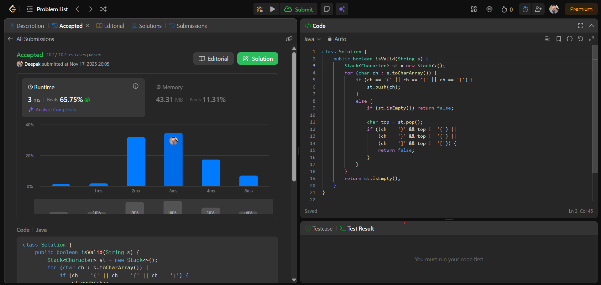

# 🧠 Day 21 – Stack (Easy)

**📅 Date:** November 17, 2025  
**💻 Language:** Java  
**📚 Topic:** Valid Parentheses (Stack-Based Bracket Matching)

---

## ✅ Problem Solved
| Problem | LeetCode # | Description |
|:--|:--:|:--|
| [Valid Parentheses](https://leetcode.com/problems/valid-parentheses/) | #20 | Determine whether a string of **() {} []** brackets is *balanced and valid* using a **stack-based matching algorithm**. |

---

## 💡 Concepts Practiced
- Used a **Stack** to check balanced parentheses  
- Understood **opening vs closing** bracket mapping  
- Applied **LIFO (Last In, First Out)** behavior  
- Practiced efficient **push–pop** operations  
- Strengthened expression-validation logic  
- Learned a clean **O(n) time, O(n) space** solution  
- Improved understanding of stack applications in interviews  

---

## 🧩 Output Screenshot
| Problem | Result |
|:--|:--|
| Valid Parentheses |  |

---

## 🏁 Summary
Day 21 of **100 Days of DSA** ✅  
Solved the classical **Valid Parentheses** problem using a simple and effective **stack-based approach**.  
This problem helped build strong skills in **bracket matching**, **error-proof logic**, and applying **LIFO principles** in real-world scenarios.  
A great step towards mastering common **stack interview patterns** 🚀🔥  
