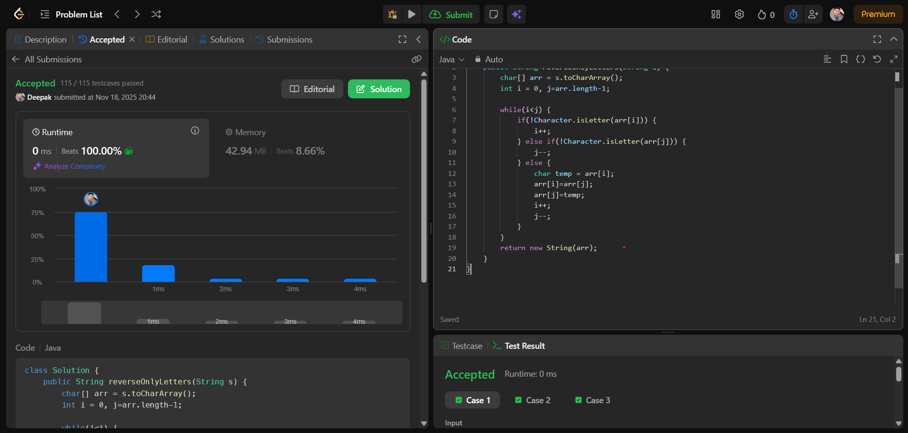

# 🧠 Day 22 – Two Pointers (Easy)

**📅 Date:** November 18, 2025  
**💻 Language:** Java  
**📚 Topic:** Reverse Only Letters (Two-Pointer Technique)

---

## ✅ Problem Solved
| Problem | LeetCode # | Description |
|:--|:--:|:--|
| [Reverse Only Letters](https://leetcode.com/problems/reverse-only-letters/) | #917 | Reverse **only the letters** in a string while keeping **digits & symbols in their original positions** using the **two-pointer approach**. |

---

## 💡 Concepts Practiced
- Understood how to use **two pointers (left & right)** effectively  
- Identified **letter vs non-letter** character handling  
- Used Java’s `Character.isLetter()` for clean checks  
- Practiced **in-place swapping**  
- Improved understanding of pointer movement logic  
- Achieved clean **O(n) time, O(1) space** solution  
- Strengthened real-world string-manipulation skills  

---

## 🧩 Output Screenshot
| Problem | Result |
|:--|:--|
| Reverse Only Letters |  |

---

## 🏁 Summary
Day 22 of **100 Days of DSA** ✅  
Solved the interesting **Reverse Only Letters** problem using the **two-pointer technique**.  
Great practice for mastering **string manipulation**, **pointer strategies**, and writing clean logic for mixed-character inputs.  

Another strong step toward mastering **core interview patterns** 🚀🔥
