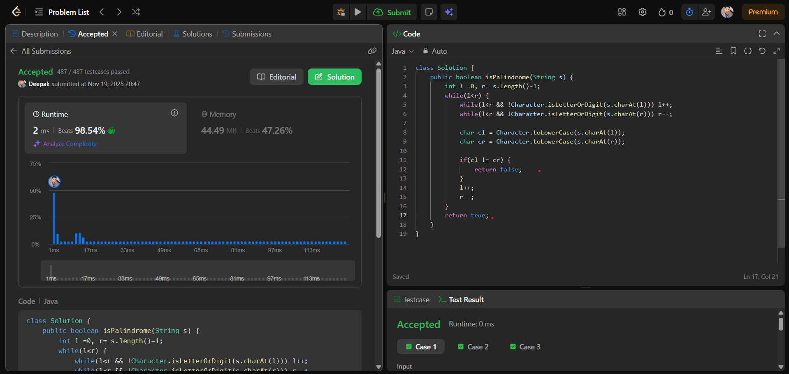

# 🧠 Day 23 – Two Pointers (Easy)

**📅 Date:** November 19, 2025  
**💻 Language:** Java  
**📚 Topic:** Valid Palindrome (Two-Pointer String Check)

---

## ✅ Problem Solved
| Problem | LeetCode # | Description |
|:--|:--:|:--|
| [Valid Palindrome](https://leetcode.com/problems/valid-palindrome/) | #125 | Determine whether a string is a **valid palindrome** by ignoring non-alphanumeric characters and comparing letters case-insensitively using a **two-pointer approach**. |

---

## 💡 Concepts Practiced
- Applied the **Two-Pointer Technique**  
- Skipped **non-alphanumeric characters** efficiently  
- Performed **case-insensitive** comparisons  
- Improved understanding of **string traversal**  
- Practiced optimized **O(n) time** logic  
- Learned clean character filtering for real-world text processing  
- Strengthened confidence in pointer-based questions in interviews  

---

## 🧩 Output Screenshot
| Problem | Result |
|:--|:--|
| Valid Palindrome |  |

---

## 🏁 Summary
Day 23 of **100 Days of DSA** ✅  
Solved the classical **Valid Palindrome** problem using a clean and optimized **two-pointer solution**.  
This question improved my skills in **string cleaning, comparison logic**, and handling **real-world text inputs** efficiently.  
A strong step forward in mastering popular **string and pointer interview patterns** 🚀🔥
