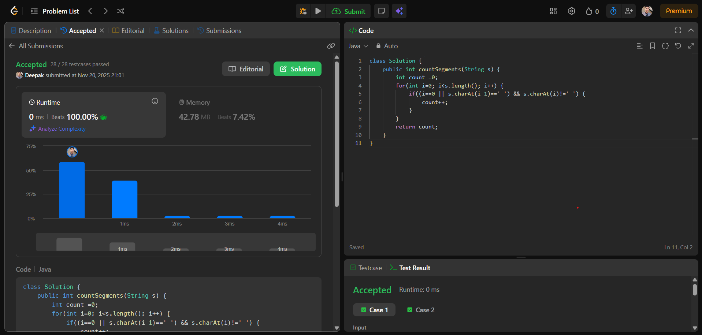

# 🧠 Day 24 – String (Easy)

**📅 Date:** November 20, 2025  
**💻 Language:** Java  
**📚 Topic:** Number of Segments in a String (Word Count)

---

## ✅ Problem Solved
| Problem | LeetCode # | Description |
|:--|:--:|:--|
| [Number of Segments in a String](https://leetcode.com/problems/number-of-segments-in-a-string/) | #434 | Count how many **words** (segments) are in a given string by checking where each new word begins. |

---

## 💡 Concepts Practiced
- Identifying **word boundaries** in a string  
- Understanding **segments** = non-space character sequences  
- Practiced simple **string traversal**  
- Learned technique to detect **start of a new word**  
- Logic building using **conditions** inside loops  
- Strengthened confidence in **string manipulation** problems  

---

## 🧩 Output Screenshot
| Problem | Result |
|:--|:--|
| Number of Segments in a String |  |

---

## 🏁 Summary
Day 24 of **100 Days of DSA** ✅  
Solved the **Number of Segments in a String** problem using clean logic to detect the **start of each word**.  
This improved my understanding of **string traversal**, **conditional logic**, and identifying **word boundaries** efficiently.  
A simple yet important problem for mastering **string-based interview questions** 🚀🔥
