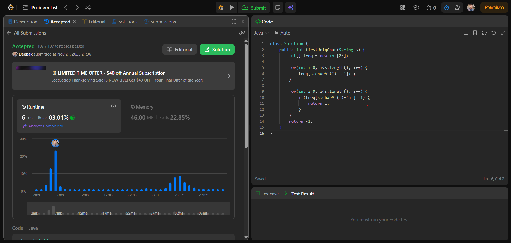

# 🧠 Day 25 – String (Easy)

**📅 Date:** November 21, 2025  
**💻 Language:** Java  
**📚 Topic:** First Unique Character in a String (Frequency Count)

---

## ✅ Problem Solved
| Problem | LeetCode # | Description |
|:--|:--:|:--|
| [First Unique Character in a String](https://leetcode.com/problems/first-unique-character-in-a-string/) | #387 | Return the **index** of the first non-repeating character by counting how many times each character appears. |

---

## 💡 Concepts Practiced
- Using a **frequency array** (`int[26]`)  
- Mapping characters using **`char - 'a'`**  
- Performing a **two-pass scan**: count → find  
- Detecting the **first non-repeated** character  
- Practiced efficient **O(n)** time string algorithm  
- Improved confidence in **array + string** based questions  
- Strong understanding of **frequency counting technique**

---

## 🧩 Output Screenshot
| Problem | Result |
|:--|:--|
| First Unique Character in a String |  |

---

## 🏁 Summary
Day 25 of **100 Days of DSA** ✅  
Solved the **First Unique Character in a String** problem using the optimal **frequency counting** method.  
This problem strengthened my understanding of **string traversal**, **frequency arrays**, and identifying **non-repeating elements** efficiently.  
A very important pattern for cracking **string-based interview questions** 🚀🔥
