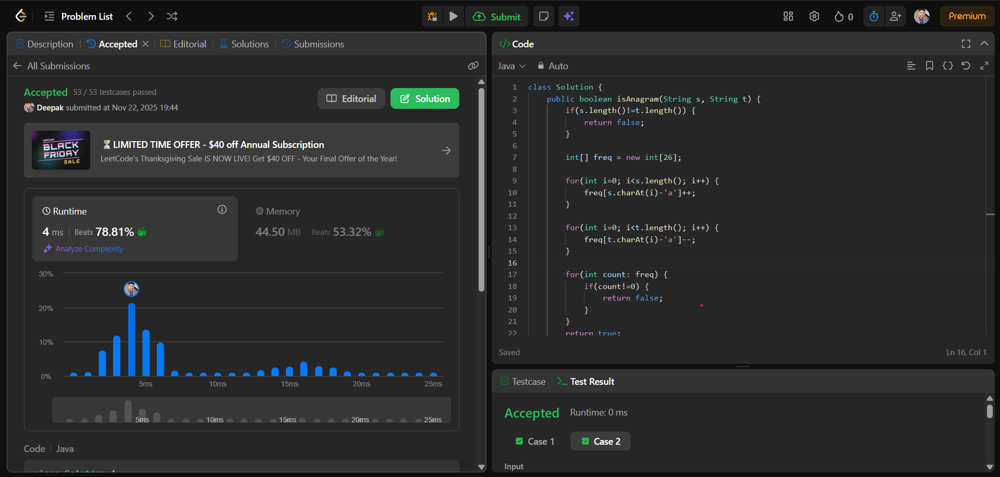

# 🧠 Day 26 – String (Easy)

**📅 Date:** November 22, 2025  
**💻 Language:** Java  
**📚 Topic:** Valid Anagram (Frequency Count)

---

## ✅ Problem Solved
| Problem | LeetCode # | Description |
|:--|:--:|:--|
| [Valid Anagram](https://leetcode.com/problems/valid-anagram/) | #242 | Determine if one string is an **anagram** of another by comparing the frequency of each character. |

---

## 💡 Concepts Practiced
- Using a **frequency array (`int[26]`)** to count characters  
- Mapping characters using **`char - 'a'`**  
- Adding for string **s**, subtracting for string **t**  
- Understanding that anagrams must have:  
  - Same characters  
  - Same frequency  
  - Same length  
- Practiced optimal **O(n)** time complexity  
- Improved confidence in **string + array** pattern questions  
- Strengthened logic using **frequency comparison technique**

---

## 🧩 Output Screenshot
| Problem | Result |
|:--|:--|
| Valid Anagram |  |

---

## 🏁 Summary
Day 26 of **100 Days of DSA** ✅  
Solved the **Valid Anagram** problem using the optimal **frequency counting** approach.  
This enhanced my understanding of **string traversal**, **array-based counting**, and the importance of verifying character frequencies when comparing two strings.  
A very common and essential interview pattern for string problems 🚀🔥
