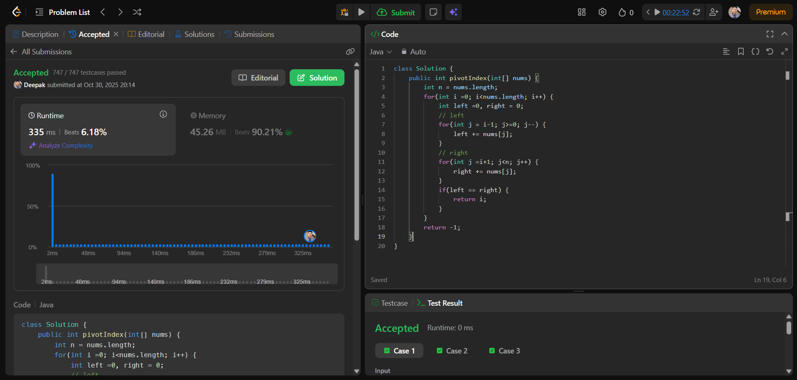
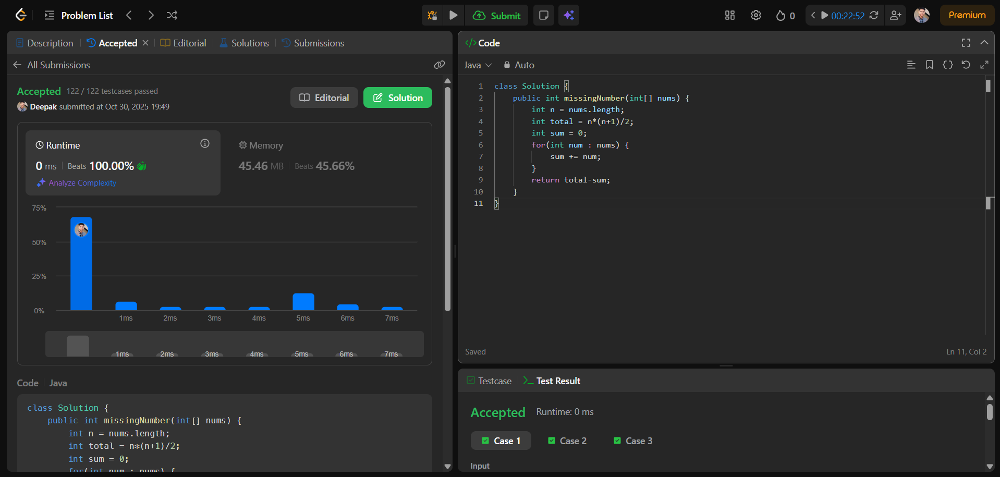

# 🧠 Day 4 – Arrays (Easy)

**📅 Date:** October 30, 2025  
**💻 Language:** Java  
**📚 Topic:** Equilibrium Index & Missing Element in Arrays  

---

## ✅ Problems Solved
| Problem | LeetCode # | Description |
|:--|:--:|:--|
| [Find Pivot Index](https://leetcode.com/problems/find-pivot-index/) | #724 | Find the index where the sum of elements on the left equals the sum on the right. |
| [Missing Number](https://leetcode.com/problems/missing-number/) | #268 | Identify the missing element from an array containing `n` distinct numbers in the range `[0, n]`. |

---

## 💡 Concepts Practiced
- Calculating prefix (left) and suffix (right) sums  
- Equilibrium index detection logic  
- Using mathematical sum formula `n*(n+1)/2`  
- Understanding loop-based vs. optimized approaches  
- Strengthening problem-solving on array traversal  

---

## 🧩 Output Screenshots
| Problem | Result |
|:--|:--|
| Find Pivot Index |  |
| Missing Number |  |

---

## 🏁 Summary
Day 4 of **100 Days of DSA** ✅  
Solved two important array problems — *Equilibrium Index* & *Missing Number*.  
Enhanced understanding of summation logic, array traversal, and index-based reasoning 🚀🔥
