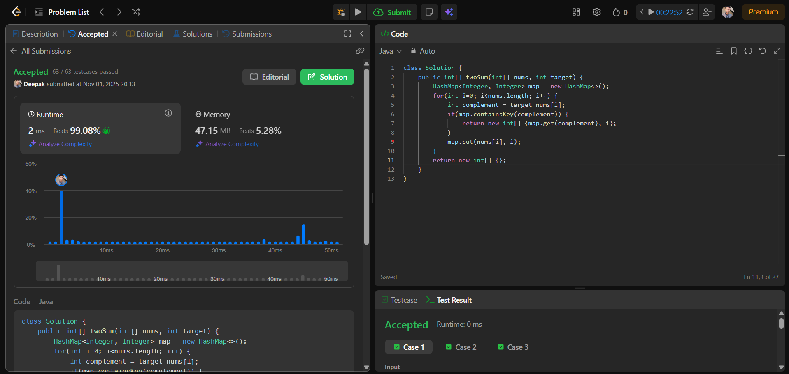
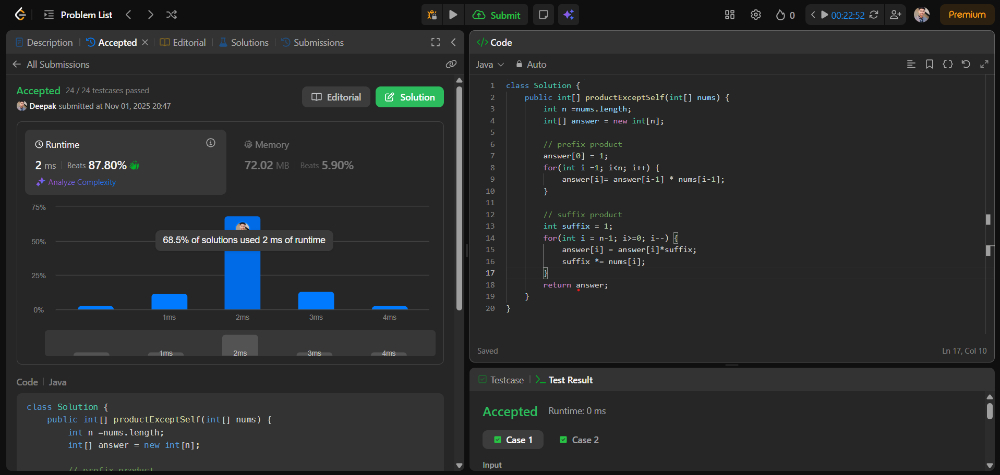

# 🧠 Day 5 – Arrays (Medium)

**📅 Date:** November 1, 2025  
**💻 Language:** Java  
**📚 Topic:** Two Sum & Product of Array Except Self  

---

## ✅ Problems Solved
| Problem | LeetCode # | Description |
|:--|:--:|:--|
| [Two Sum](https://leetcode.com/problems/two-sum/) | #1 | Find indices of the two numbers that add up to the given target. |
| [Product of Array Except Self](https://leetcode.com/problems/product-of-array-except-self/) | #238 | Return an array where each element is the product of all elements except itself, without using division. |

---

## 💡 Concepts Practiced
- HashMap usage for constant-time lookup  
- Complement concept in sum-based problems  
- Prefix & Suffix product computation without division  
- Optimizing time complexity from O(n²) → O(n)  
- Strengthening logic in array traversal and data mapping  

---

## 🧩 Output Screenshots
| Problem | Result |
|:--|:--|
| Two Sum |  |
| Product of Array Except Self |  |

---

## 🏁 Summary
Day 5 of **100 Days of DSA** ✅  
Solved two essential problems — *Two Sum* & *Product of Array Except Self*.  
Learned efficient use of HashMap for target search and mastered prefix-suffix logic for array products ⚡  
Boosted confidence in optimizing array algorithms and memory-efficient problem-solving 🚀🔥
