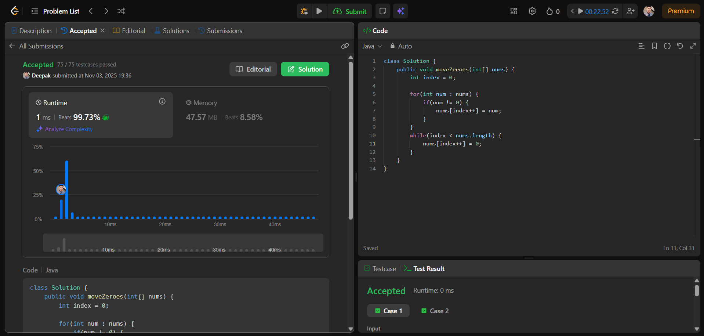

# 🧠 Day 7 – Arrays (Easy)

**📅 Date:** November 3, 2025  
**💻 Language:** Java  
**📚 Topic:** Move Zeroes  

---

## ✅ Problem Solved
| Problem | LeetCode # | Description |
|:--|:--:|:--|
| [Move Zeroes](https://leetcode.com/problems/move-zeroes/) | #283 | Move all zeros to the end of the array while maintaining the relative order of non-zero elements. |

---

## 💡 Concepts Practiced
- **Two-pointer technique** (`index`, `i`) for in-place rearrangement  
- Shifting non-zero elements forward efficiently  
- Filling remaining positions with zeros  
- **In-place array manipulation** without extra space  
- Optimized **O(n)** single-pass traversal  
- Strengthened understanding of **array reordering logic**

---

## 🧩 Output Screenshot
| Problem | Result |
|:--|:--|
| Move Zeroes |  |

---

## 🏁 Summary
Day 7 of **100 Days of DSA** ✅  
Practiced a key array rearrangement problem using the **two-pointer approach**.  
Learned how to shift non-zero elements forward and handle zeros efficiently — boosting in-place logic and array manipulation confidence ⚡🚀  
