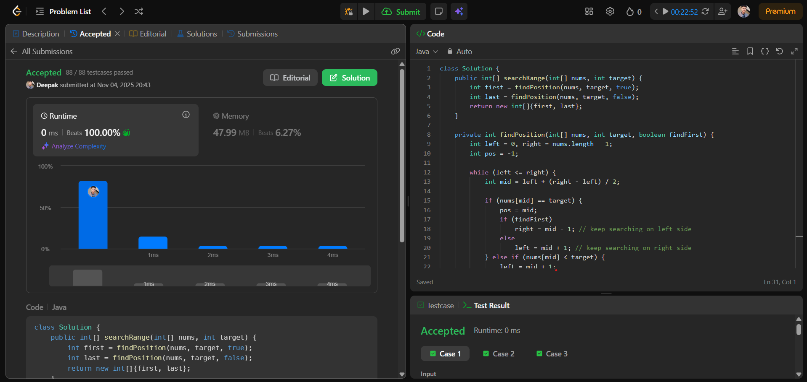

# 🧠 Day 8 – Binary Search (Medium)

**📅 Date:** November 4, 2025  
**💻 Language:** Java  
**📚 Topic:** Find First and Last Position of Element in Sorted Array  

---

## ✅ Problem Solved
| Problem | LeetCode # | Description |
|:--|:--:|:--|
| [Find First and Last Position of Element in Sorted Array](https://leetcode.com/problems/find-first-and-last-position-of-element-in-sorted-array/) | #34 | Find the starting and ending index of a given target element in a sorted array using modified binary search. |

---

## 💡 Concepts Practiced
- **Binary Search** implementation in both directions  
- Finding **first and last occurrence** efficiently  
- Understanding **mid-pointer adjustment** logic  
- Handling cases where the **target doesn’t exist** (`[-1, -1]`)  
- Achieving **O(log n)** time complexity  
- Strengthened problem-solving in **sorted array search logic**

---

## 🧩 Output Screenshot
| Problem | Result |
|:--|:--|
| Find First and Last Position |  |

---

## 🏁 Summary
Day 8 of **100 Days of DSA** ✅  
Solved a medium-level **binary search** problem to locate the first and last occurrence of a target efficiently.  
Improved my ability to manipulate search space using left-right boundary logic and gained deeper confidence in **binary search mastery** 🔍🚀  
